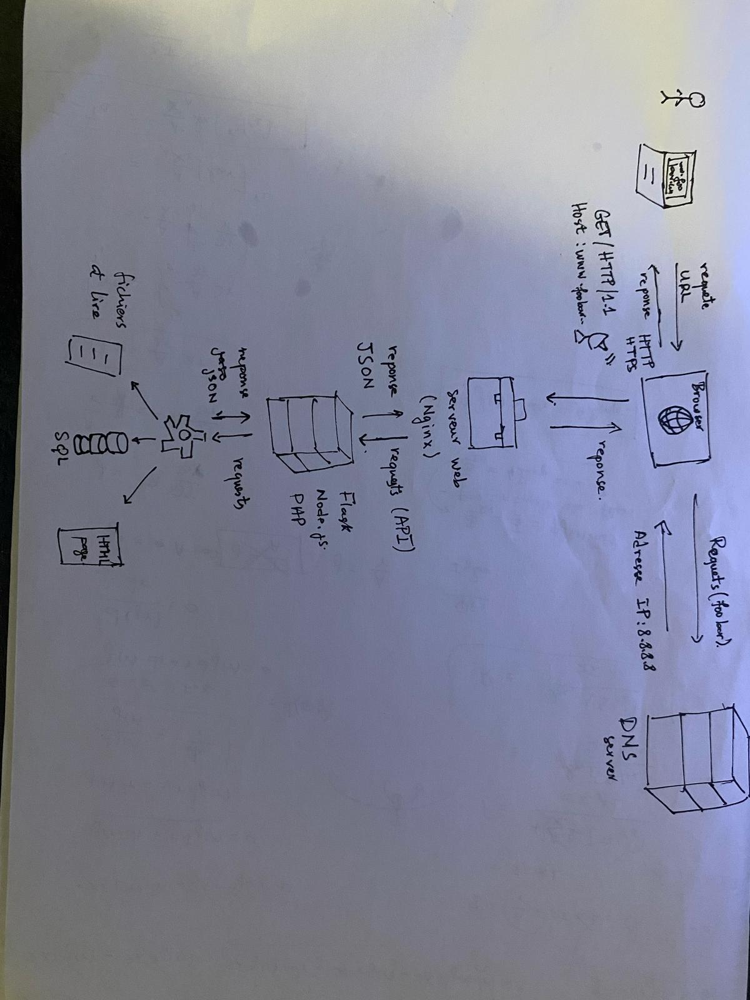

# 0. Simple Web Infrastructure

This document describes a simple one-server web infrastructure used to host the website accessible via [www.foobar.com](http://www.foobar.com).

## 🔁 User Request Flow

1. A user types `www.foobar.com` in their browser.
2. The domain name resolves to the IP address `8.8.8.8` via a **DNS A record**.
3. The browser sends an HTTP request to `8.8.8.8`.

## 🌐 Components of the Infrastructure

### 1. Domain Name
- **foobar.com** is the domain name.
- The `www` subdomain has an **A record** that points to `8.8.8.8`.

### 2. Web Server (Nginx)
- Receives HTTP requests from users.
- Serves static content or forwards requests to the application server.

### 3. Application Server
- Executes the website's backend logic (e.g., PHP, Python, Node.js).
- Processes user requests and interacts with the database.

### 4. Application Files
- The code base: HTML, CSS, JavaScript, backend scripts, etc.

### 5. Database (MySQL)
- Stores dynamic content, user data, etc.
- Responds to queries from the application server.

## 📡 Communication

- The server communicates with the user's browser over **HTTP/HTTPS** (port 80 or 443).
- Internally, Nginx communicates with the app server (e.g., via FastCGI, HTTP).
- The application server communicates with MySQL over TCP (port 3306).

## ⚠️ Issues With This Setup

- **SPOF (Single Point of Failure)**: If the server crashes, the entire site is down.
- **Downtime for Maintenance**: Deploying code or restarting services interrupts access.
- **Scalability Limitations**: One server can’t handle large traffic surges.

---

🛠️ You can now **preview** this Markdown file in VSCode (clic droit → *"Open Preview"*) to see how the image and structure render.

Souhaites-tu aussi un schéma plus complexe (ex. avec plusieurs serveurs, load balancer, etc.) ?
