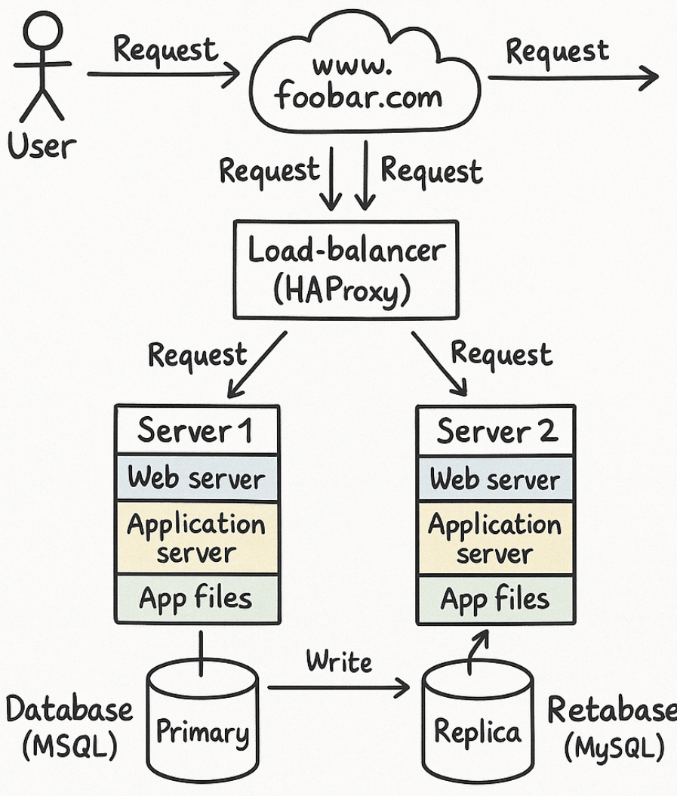

# 1. Three Server Web Infrastructure Design

## 🔄 User Request Flow

1. A user types `www.foobar.com` in their browser.
2. The domain's DNS record resolves to the IP address of the **Load Balancer**.
3. The **Load Balancer** distributes the request to one of the two backend **web servers**.
4. The selected **web server** forwards the request to the local **application server**.
5. The application server queries the **Primary Database**, and the response is sent back to the user.

---

## 🌐 Components of the Infrastructure

### 1. Domain Name and DNS

* **Domain**: `foobar.com` with a **www A record** pointing to the IP of the **Load Balancer**.

### 2. Load Balancer (HAProxy)

* Distributes traffic between two backend servers.
* Configured with **Round Robin** algorithm:

  * Each server receives requests in a rotating order.
  * Ensures even distribution of load.
* **Setup**: Active-Active (both servers handle traffic simultaneously).

  * **Active-Active**: All servers are active and share the load.
  * **Active-Passive**: One server is active, the other is standby, activated only on failure.

### 3. Two Backend Servers

Each contains:

* **Web Server (Nginx)**: Handles HTTP requests, serves static content, forwards dynamic requests to the application server.
* **Application Server**: Contains the backend logic of the website.
* **Application Files**: Website's code base.

### 4. Database Cluster (Primary-Replica / Master-Slave)

* **Primary Node**: Accepts write and read requests.
* **Replica Node**: Only accepts read requests.

  * Synchronized periodically with the Primary.
* The application is configured to:

  * **Write to Primary**
  * **Read from Replica** when possible to reduce load.

---

## ⚠️ Issues in This Infrastructure

### 1. Single Points of Failure (SPOF)

* **Load Balancer**: If it fails, the whole system becomes inaccessible.
* **Primary Database**: Its failure prevents write operations.

### 2. Security Issues

* No **Firewall**: Servers are exposed to potential attacks.
* No **HTTPS**: Data is transmitted unencrypted.

### 3. No Monitoring Tools

* No system to detect outages, performance degradation, or unauthorized access.

---

## 📁 Summary Diagram (Not Included)

A diagram should show:

* The user -> DNS -> Load Balancer -> Web Servers -> Application Servers -> Database (Primary + Replica)
* Connections from the Load Balancer to both servers.
* A single Primary database connected to a Replica.

---

This setup improves availability and scalability compared to a single-server infrastructure but still requires further security and reliability measures like firewall rules, HTTPS, monitoring, and automatic failover.
